I guess it's time to do like everyone else. Let's recap the terrible stuff I enjoyed this year.

== Best video games released in 2024 I played

Order does not reflect any kind of preference.

=== Space Marine 2

It's a great game. The campaign is OK-ish, but the co-op multiplayer is excellent.

The way the game works is full of small details that make it enjoyable.

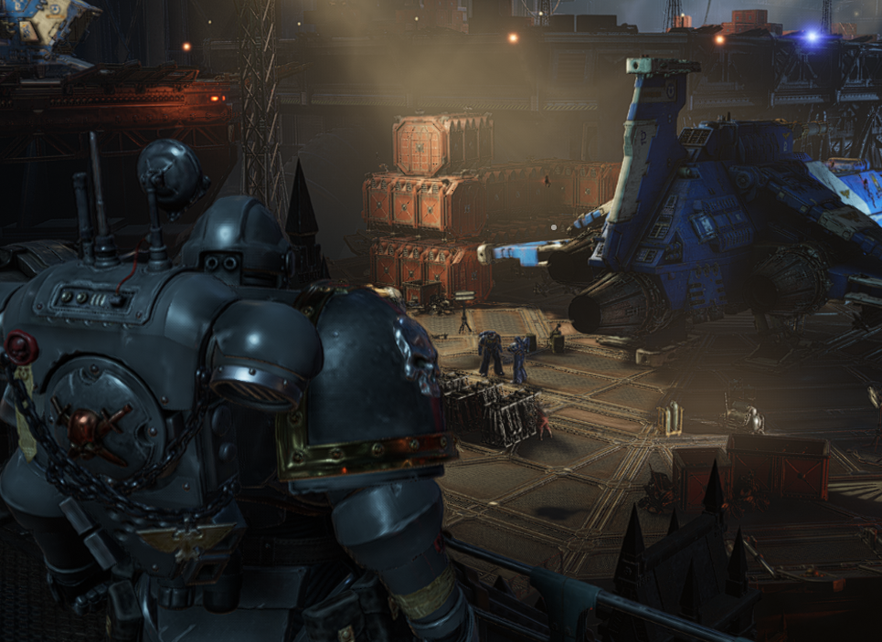

From the progression that forces you to go in higher difficulties, to how you can always be in control of the situation no matter the odds, it's a very satisfying game to grind and enjoy. Lots of different way to play and to enjoy. PvP is fun.

.Better weapons requires items you can only get in higher difficulties.
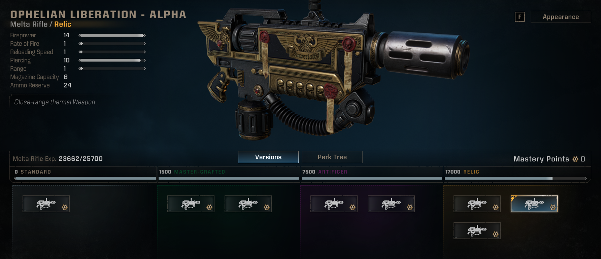

=== Last Epoch

It's a diablo-like. It's good. It has a close combat mage skill tree, and that was the only reason I played it. And It was good.

.My stupid character
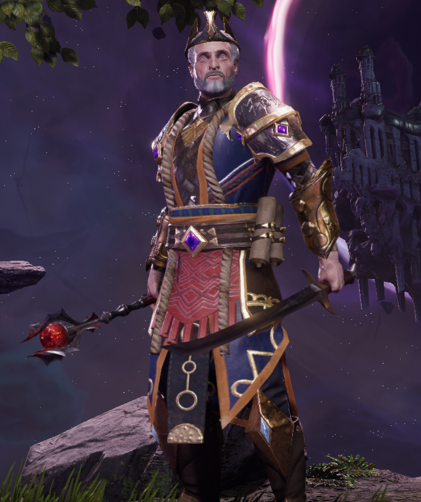

.The spellblade passive tree
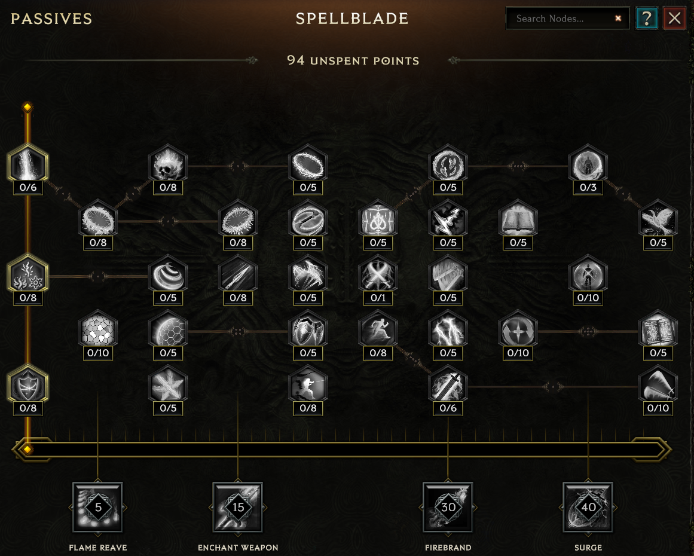

It has some good depth, but is still not too complicated to get into.

=== Buriedbornes 2

Finally, the autistic builds dungeon crawler got a sequel. It's an entirely new grind. Just like the original, it will be launched sporadically for a few frantic sessions then be left on the corner of the steam library. Always ready, always available.

.The UI is still very close to the original.
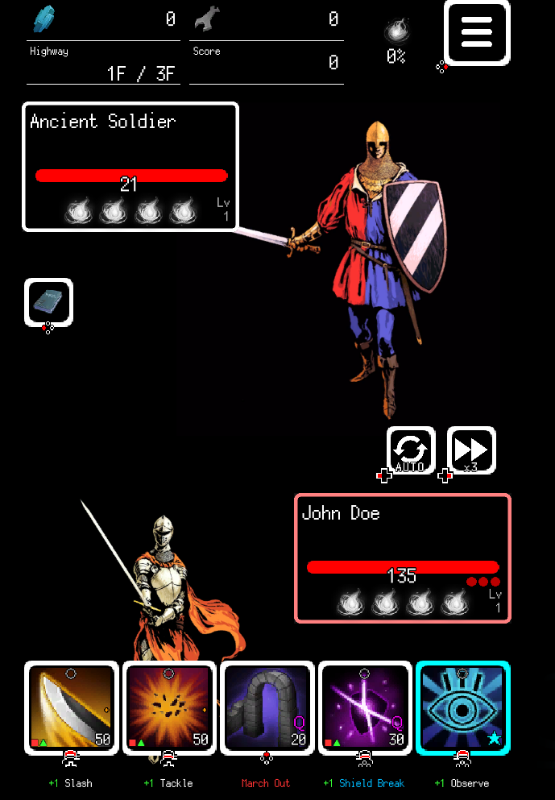

For those who don't know the original, it's a dungeon-crawling / roguelite game with an absurd range of skills and possibilities and synergies. But that goes for the ennemies too. It's free to play, and the only thing you can get from the paid stuff are skins. Which are still images, this is a game with no animations.

=== Subterrain: Mines of Titan

The original Subterrain game was a real time, top down survival horror game with tower defense elements. The day, you'd scavenge and explore a space station riddled with monsters, trying to make the whole station work properly again. At night, monsters would attack the core of the station that you'd have to defend. You were alone against all odds.

The follow-up game is a turn-based survival exploration game with RPG elements. You have multiple questlines with multiple characters. It's a very different game that doesn't have the same appeal as the original.

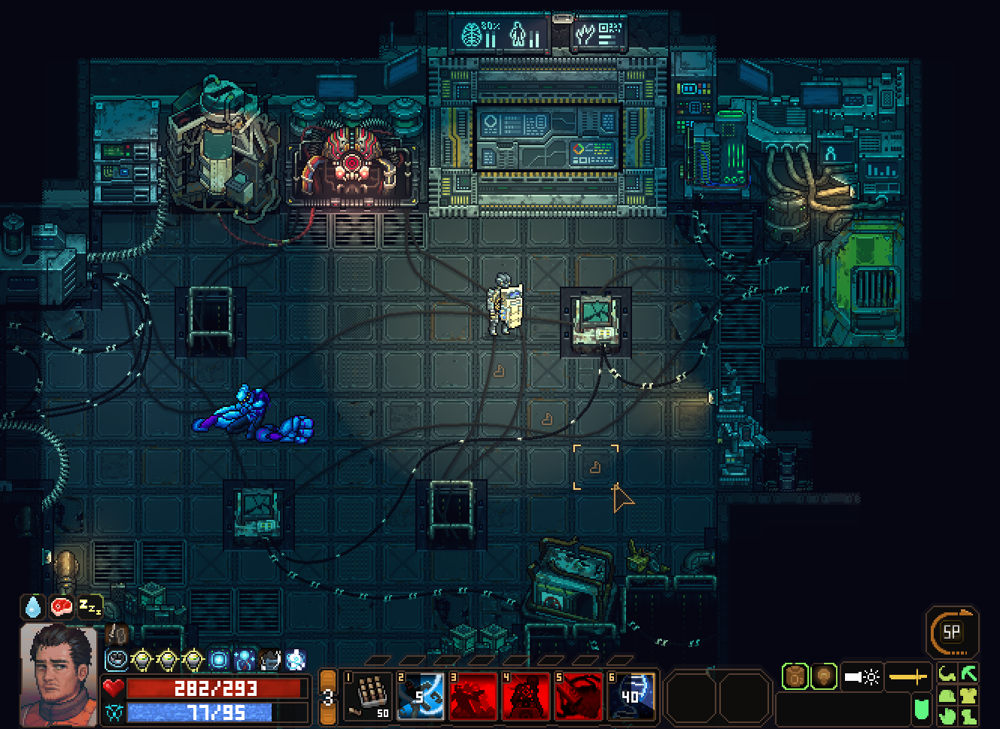

But I liked it. I liked how the armour system in the game worked and kept you on your toes at all times. Even in the late game, being swarmed was a real risk.

Writing wasn't very good, but serviceable. The plot itself was ok too. I enjoyed the game, but won't play it another time. It had OK art and was fun, even if slightly tedious sometimes.

== Best video game I played in 2024

=== Shadows of Forbidden Gods

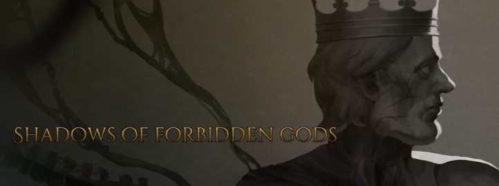

I cannot express how much this game blew my mind.

This game is a cthulhu simulator: you are a forbidden god, who wants to conquer or destroy the world. But you're weak, you need to build your forces and powers before.

You have a few envoys to do that. Their possibilities are limited. Maybe bribe some guards to infiltrate a city. Buy a few mercenaries, go a few kingdoms farther and burn some farmlands, starting a famine. This makes the rulers and heroes focus on this while you are killing a few orc warlords to take their banner. Next thing you know, you just united all the orc warbands. Time to make some real trouble? Oh but this is just another distraction: now that all armies are turned toward the orcs, it leaves you free to corrupt the land, the rulers.

Shadows of Forbidden Gods is a game where each action will have consequences, sometimes much much later. Start a plan, but be always ready to adapt to what might happens. Light the fire, and watch the world burn.

It also has a very... Peculiar UI.

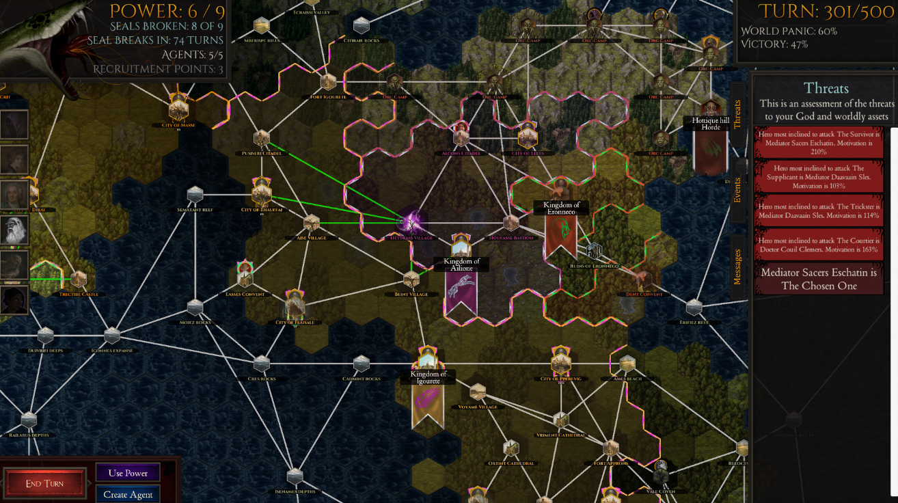

Honestly, don't be afraid. It's a much simpler game to handle that it might seem.

It's a game about experimenting in this sandbox of AI agents with various goals, priorities and decision trees. Because the world is living by itself, a lot of things happen every turn, and there's always something to exploit.

It's a game that creates stories of the end of the world by itself, and it's goddamn fun to be at the center of it.

== Best webtoons/mangas I read in 2024

=== The greatest estate developper

The level of stupid of this series can not be overstated. It's a civil engineer that get isekai'd in a fantasy novel as the good-to-nothing-first-to-be-killed character. He becomes the greatest hero of the kingdom by building facilities and houses. And by singing (terribly). And by coercing people into thinking he's the best thing he has ever happened in their lives and making them work for him THEN thank him for it.

It's one of the few media that made me laugh out loud this year. It's so stupid it hurts.

=== Usuzumi no Hate / The color of the end : Mission in the Apocalypse

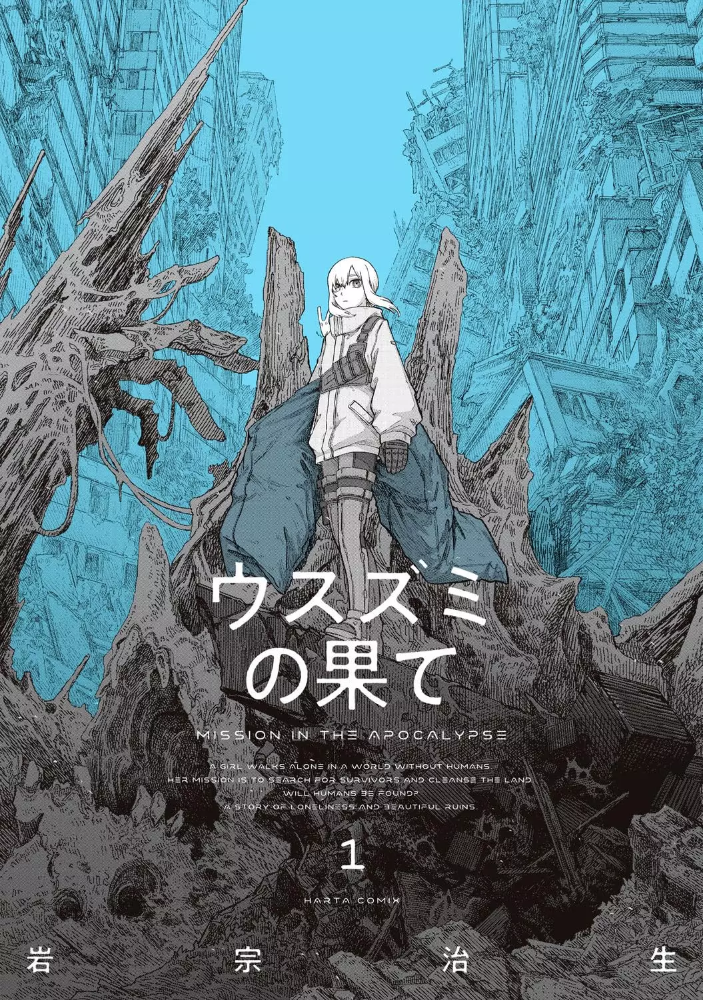

This has a lot of Blame! vibes, and you can't go wrong with Blame! vibes.

A girl is looking for the last humans in a world that was hit by a cataclysmic disease.

The art itself is worth a look.

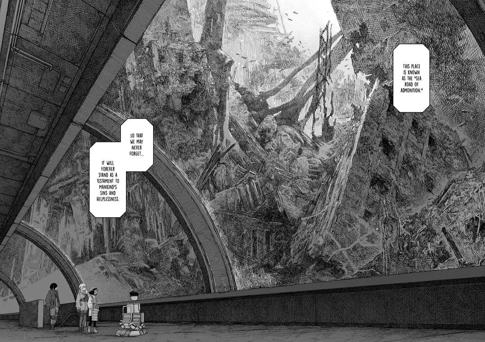

== Best books

=== The Horus Heresy series

It's been a few months that I started the Horus Heresy series, the prequel to the Warhammer 40k universe.

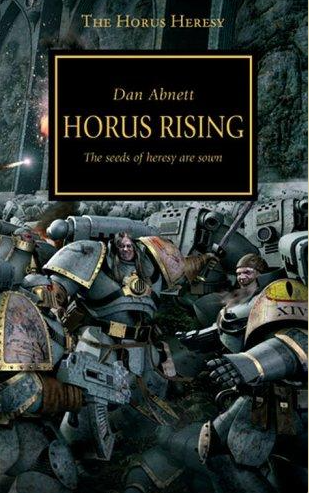

It is surprisingly good! Some books are standalone, some kinda follow the same events from different points of view... There are many interesting stories in these dark times of the this universe where the Imperium falls from grace to become the crazy thing that it is in 40k.

== Best Music released in 2024

=== Flight b741 / King Gizzard & the Lizard Wizard

Another crazy album from this legendary group. Going for old school rock.

++++
<iframe style="border: 0; width: 100%; height: 120px;" src="https://bandcamp.com/EmbeddedPlayer/album=104852051/size=large/bgcol=ffffff/linkcol=0687f5/tracklist=false/artwork=small/transparent=true/" seamless><a href="https://kinggizzard.bandcamp.com/album/flight-b741">Flight b741 de King Gizzard &amp; The Lizard Wizard</a></iframe>
++++

=== i want to make something as beautiful as you / Sadness

It's great cheerful/melancolic shoegaze. Can't stop listening it.

Sorry but apparently the author made the album private, so I can't share it to you. Strange !

=== Orange Sunshine / wizard war

Wizard war has become my go-to "ambient music" when i need something in the background to chill. One of the tag is "lo-fi bedroom rock" and it fits very well with it. Start it, let it chill, and realize a few hours laters that you're still humming it: that's the wizard war experience.

++++
<iframe style="border: 0; width: 100%; height: 120px;" src="https://bandcamp.com/EmbeddedPlayer/album=796068507/size=large/bgcol=ffffff/linkcol=0687f5/tracklist=false/artwork=small/transparent=true/" seamless><a href="https://wizard-war.bandcamp.com/album/orange-sunshine">Orange Sunshine de wizard war</a></iframe>
++++

=== Sky Hundred / Parannoul

Parannoul is a korean shoegaze band. Their music is overall cheerful, but with the right amount of loudness that can be expected from this style.

++++
<iframe style="border: 0; width: 100%; height: 120px;" src="https://bandcamp.com/EmbeddedPlayer/album=3202403356/size=large/bgcol=ffffff/linkcol=0687f5/tracklist=false/artwork=small/transparent=true/" seamless><a href="https://parannoul.bandcamp.com/album/sky-hundred">Sky Hundred de Parannoul</a></iframe>
++++

=== Making A Ghost / Captain Shrugs

I don't know why I love Captain Shrugs so much. It's so raw, so pure. I just love all of this guy's albums.

++++
<iframe style="border: 0; width: 100%; height: 120px;" src="https://bandcamp.com/EmbeddedPlayer/album=2389209087/size=large/bgcol=ffffff/linkcol=0687f5/tracklist=false/artwork=small/transparent=true/" seamless><a href="https://captainshrugs.bandcamp.com/album/making-a-ghost">Making A Ghost de Captain Shrugs</a></iframe>
++++
