I started this last year, so at least i can say that i posted once a year on this blog.

== Video games : new games

I'm glad steam has a recap, cause it makes this easy. Order is relatively chronological then. By new games I mean games that i discovered this year, not necessarily released this year.

=== https://store.steampowered.com/app/2128270/Path_of_Achra/[Path of Achra]

Path of Achra is an incredibly stupid game. It's a pseudo roguelike, where you pick a race, a class, and the divinity your character adheres to. Then off you go. You can control the character with the arrow keys, or use the two most important buttons: "Attack-move" or "Stay still".

Here's the thing, this game present itself as a "broken build simulator", and it is not a lie: the skills, weapon perks and starting choices can lead to absolutely stupid builds.

What about an "Ape Assassin" naked with a just an axe, that one-shots everyone before anyone can react?

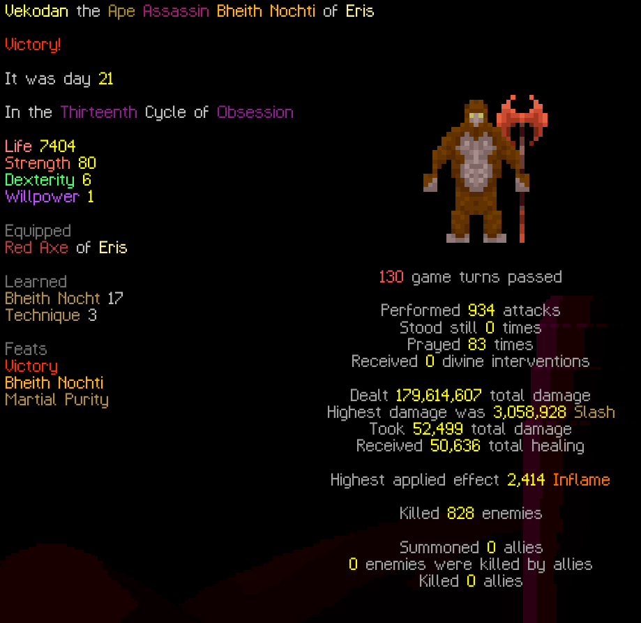

A double bladed warrior that kills by stacking damages that heal at the same time?

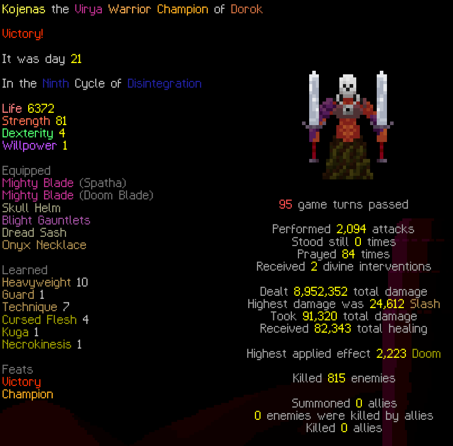

Or a shapeshifter that transforms into a snake moving faster than light, while poisoning everyone?

image::poa_snake.png[]

Or that one build i called the "cancermancer", that fills the map with shrooms that return damage continuously, forcing the ennemies to kill themselves to reach you?

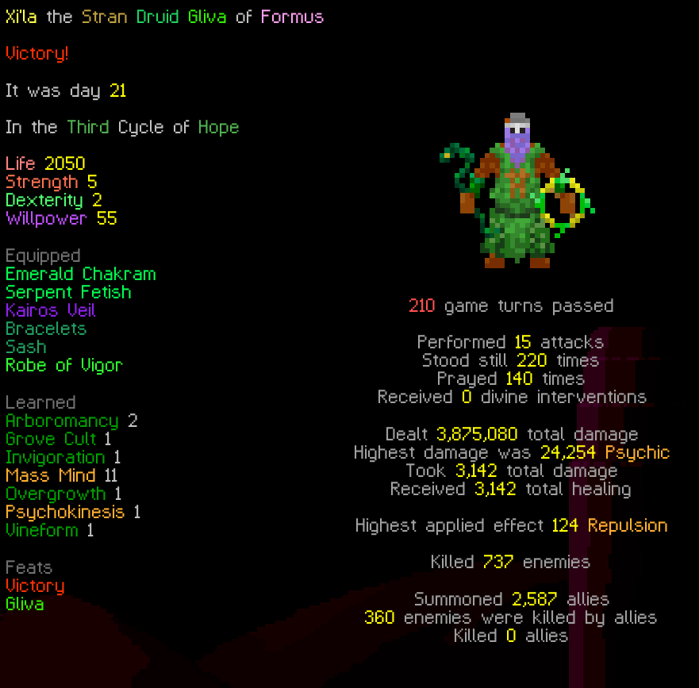

Anyway, that's enough examples. This is a cheap game with an insane amount of replayability.

Sseth has done a review of it, if you're not yet convinced.

++++
<iframe width="560" height="315" src="https://www.youtube.com/embed/isDvLHb83B8?feature=oembed" frameborder="0" allow="accelerometer; autoplay; clipboard-write; encrypted-media; gyroscope; picture-in-picture; web-share" referrerpolicy="strict-origin-when-cross-origin" allowfullscreen title="Path Of Achra Review | Struggler Edition"></iframe>
++++

=== https://store.steampowered.com/app/1353230/Bomb_Rush_Cyberfunk/[Bomb Rush Cyberfunk]

Somes guys said "fine, i'll do my own Jet Set Radio game". It's a cool game.

++++
<iframe width="560" height="315" src="https://www.youtube.com/embed/fckQom8gTvA?feature=oembed" frameborder="0" allow="accelerometer; autoplay; clipboard-write; encrypted-media; gyroscope; picture-in-picture; web-share" referrerpolicy="strict-origin-when-cross-origin" allowfullscreen title="Bomb Rush Cyberfunk - Official Trailer"></iframe>
++++

The artstyle is fantastic, the soundtrack is great (with some titles made by uncle hideki himself)

If you enjoyed Jet Set Radio back in the days, there are no reasons not to enjoy this one.

=== https://store.steampowered.com/app/1426450/Age_of_Darkness_Final_Stand/[Age of Darkness : Final Stand]

It's a direct concurrent to They Are Billions. It's a STR game in a fantasy setting with a zombie invasion. You must defend your settlement until you can't.

image::age_of_darkness.png[]

It's a decent game. I mostly played it because there's a multiplayer co-op mode. It's not as good as They Are Billions, and the latest reviews tend to say it has been abandoned by the devs while still being a bit buggy. If it's on sale and you have a friend to play with, I think it's worth it.

=== https://store.steampowered.com/app/2286390/Tunnet/[Tunnet]

Tunnet is a strange game about building a computer network inside an abandonned cave. Humanity seems to have ceased to exists, there are monsters lurking in the shadows, but you better still configure that router properly.

image::tunnet_1.png[]

So it's half a horror game, half a nerd game. Cause no, i'm not joking, there is an ip (light) system in this game.

image::tunnet_2.png[]

The target audience for that kind of game is kinda limited, but honestly, if you're reading this, there's a chance you're into that. For 6 bucks (even less in sale), it's a cool experience.

=== https://store.steampowered.com/app/2180700/ABIDOS/[ABI-DOS]

Now we're really going in autistic territory. Let's just start this a screenshot.

image::abidos_1.png[]

Yeah.

It's kind of a visual programming game, except blocks are more assembly-level than any-high-level-language-level component. It's a puzzle game for nerds, and it's honestly great. Not a Zachtronics game, but underestimated in my opinion.

image::abidos_2.png[]

If you're into that kind of game, it's a guaranteed hit.

=== https://store.steampowered.com/app/2749100/Dawnmaker/[Dawnmaker]

It's a deck-building game where you build a settlement with various buildings that interact and produce resources. You have to manage carefully as your upkeep keeps going up, until you lose or reach the objective. As stated on the steam page, it's kind of a solo board game.

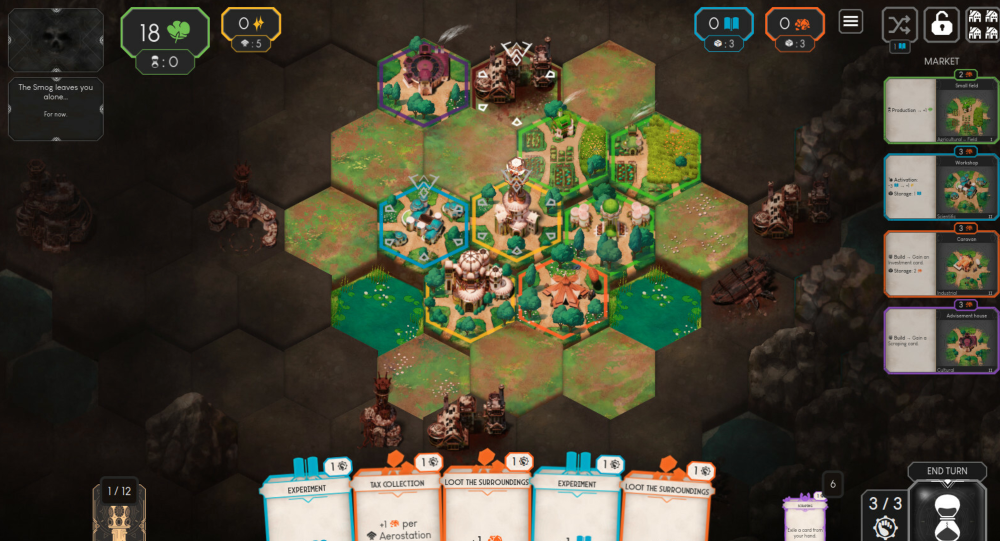

The art is nice on the eyes, it's relaxing while challenging. I enjoyed it a lot, until i kinda got around winning with every starting options, and felt like i had seen everything on it.

It's a good game though.

=== https://store.steampowered.com/app/2420880/WitchHand/[WitchHand]

A resource management game inspired by the fantastic https://store.steampowered.com/app/718670/Cultist_Simulator/[Cultist Simulator]. Just like Cultist, you have a board, cards that interact with each other, and it's real-time.

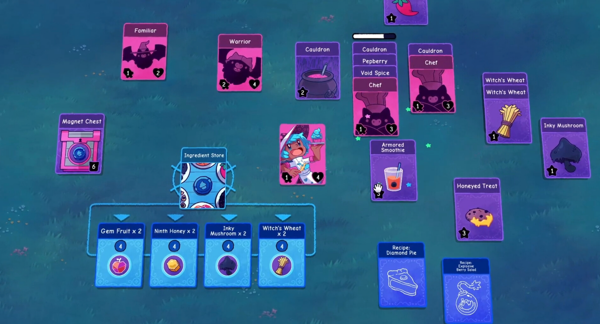

There are a few starting options, represented by cute witches, that have their specific mechanics. Overally it has some good replayability and was very fun. If you're into resource management games, it should be up your alley.

image::witchhand_2.png[]

=== https://store.steampowered.com/app/3123410/Atelier_Yumia_The_Alchemist_of_Memories__the_Envisioned_Land/[Atelier Yumia: The Alchemist of Memories & the Envisioned Land]

The latest Atelier game has its fair share of cute girls and obnoxious characters.

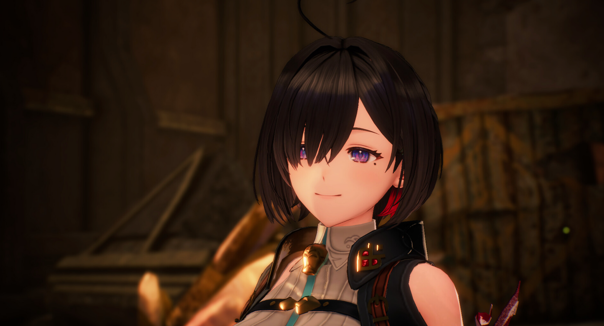

Moving from turn based combat to a more open-world and action style, I was kinda expecting this game. Sadly, when I played it, it was extremely poorly optimised, which hampered the experience. Also the difficulty was all over the place: playing on normal mode was not challenging at all, and amping up the difficulty suddenly made some simple monsters just wiping your team instantly.

image::atelier_yumia_2.png[]

Alchemy in this game was very boring. My latest Atelier was Sophie 2 and I absolutely loved it. In this game, Alchemy was not a fun thing to do and wasn't even bringing a lot of value in term of stats, equipment, bonuses... Meaning you'd rarely do it, which is strange for a series supposedly mostly about crafting.

I wish it was a slightly better game. Maybe it has been patched enough for a bit more QoL and better performances.

=== https://store.steampowered.com/app/3553210/Auto_Rogue/[Auto Rogue]

Some people, myself included, really liked FFXII's gambit system. It was pretty much a way to pseudo-program your characters so they could act appropriately in combat situations.

Auto Rogue pretty much takes the Gambit system and makes a roguelike around it. Instead of getting equipment, you loot "actions", and "conditions", to build an automated warrior that can handle all situations.

image::auto_rogue_1.png[]

There are a 2 classes: a warrior with a stamina-like resource, and a mage that has mana to manage too.

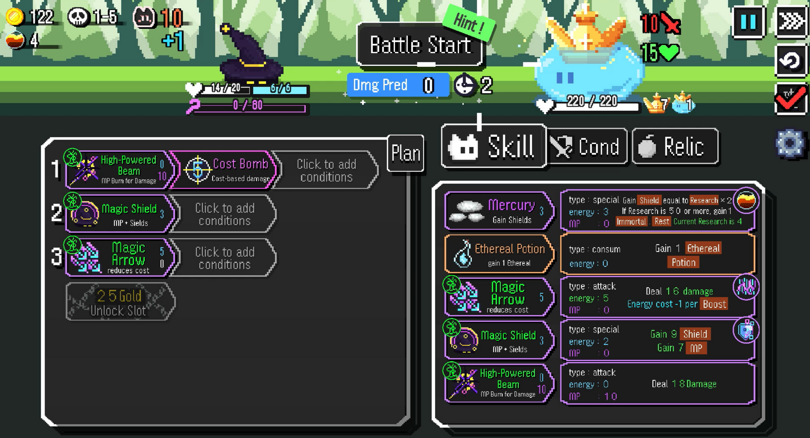

It's a really good game. A bit too easy, but for 7 bucks it is very very enjoyable, and the only true alternative to FFXII's Gambit.

=== https://store.steampowered.com/app/2971610/HOLE/[Hole]

Hole is a strange game. It's a "casual extraction shooter". You're thrown into a facility, must find stuff, and get out of it. It's also completely insane.

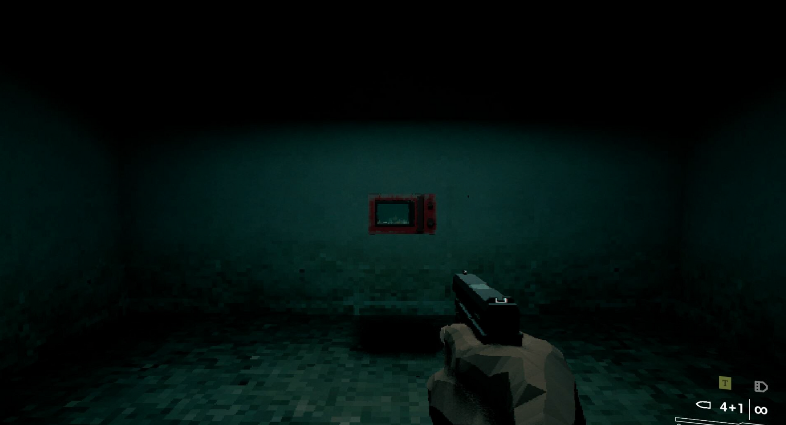

There is no true plot, but there are a lot of details to discover in the levels, such as secret rooms.

It's not a horror game per-se, but the ambiance in the levels is carefully crafted to be unsettling. Also the graphics are voluntarily a bit grainy and i personally love it.

There is a meta progression that makes the game gradually different. Your first run are all about surviving, but the more you play the more you are inclined to stay in the level to make bigger ennemies spawn to get their loot.

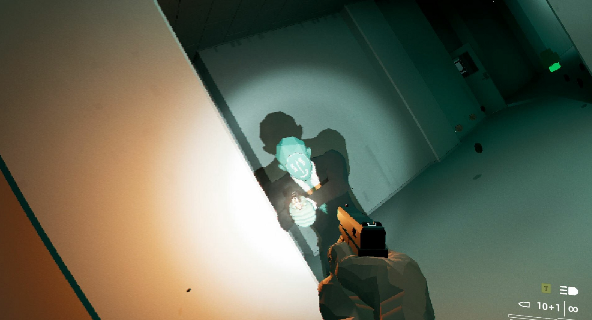

It's a short game. In something like 6-8 hours you will have done everything in it, but they will be absolutely stuck in your brain forever. For a 5 dollar game, it's clearly worth it.

=== https://store.steampowered.com/app/1669000/Age_of_Wonders_4/[Age of Wonders 4]

I had never played the Age of Wonders series before. It's a 4X games in the line of Civilization with combat a la Heroes of Might & Magic. I had heard a lot of good things about the 4th and on a whim decided to try it.

Oh boy.

What a fucking good game.

image::aow4_1.png[]

Age of Wonders 4 is fun. It's fun because the game is always very dynamic, and because the replayability is absolutely insane.

In the beginning of the game, you choose a faction and a hero. They can be customized with a lot of perks. This lead to a huge amount of combinations you can do, that can completely change your experience. Just out of memory, here are some builts i played (and mostly using pre-defined characters!):

- Undead faction that can reach a point where they can't lose a fight because they enter a loop of "unit dies -> get mana -> use mana to revive all units as allies".
- Warriors that get permanent upkeep when razing a city, starting with a single city under the earth, pillaging everything
- Holy warriors that vassalize city-states and previous ennemies, winning by simply not having any enemy anymore

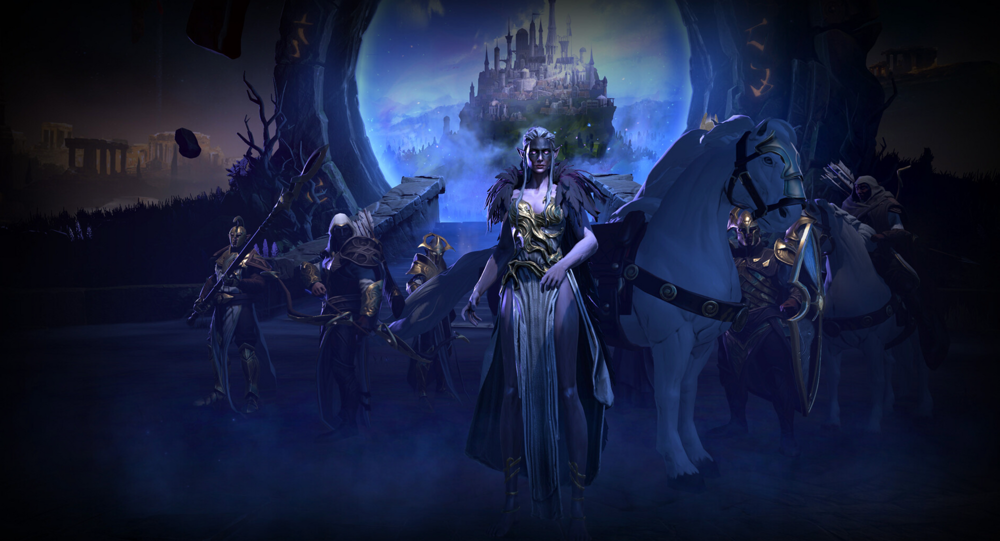

Even the world map has modifiers, which can change a lot how the game will be played. You can even start with random modifiers that won't be known until you start playing.

But it's not just about random games, there are also scenario-games, with special quests and gameplay mechanics. The game is deep, fun, leads to great ways to play, and is easy to play.

If you have never played this series and enjoy turn based strategy, you _must_ try it.

=== https://store.steampowered.com/app/2132850/Rabbit_and_Steel/[Rabbit and Steel]

Rabbit and Steel is two games in one.

When you play solo, it's a bullet hell game with cool action mechanics.

When you play multiplayer, it's a dungeon boss rush. If you're into dodging aoes and aligning yourself with other players to avoid a wipe, this is the quintessential game for you. Don't be fooled by the cute rabbit girls, the game is hard and will punish you.

image::rabbit_and_steel_1.png[]

At the end of each boss, you get a chance to take some loot that will improve your character. But other players might want the same stuff than you, so pick wisely!

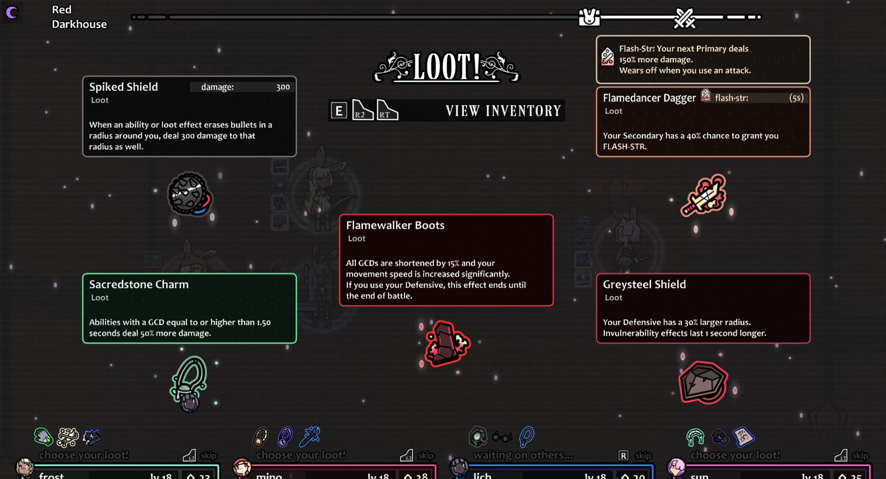

With its multiple classes that all have very different ways to play (some more into buffing allies, others into triggering effects, some more focused into hitting behind ennemies...), it's very very replayable. There is no meta progression, each run starts over.

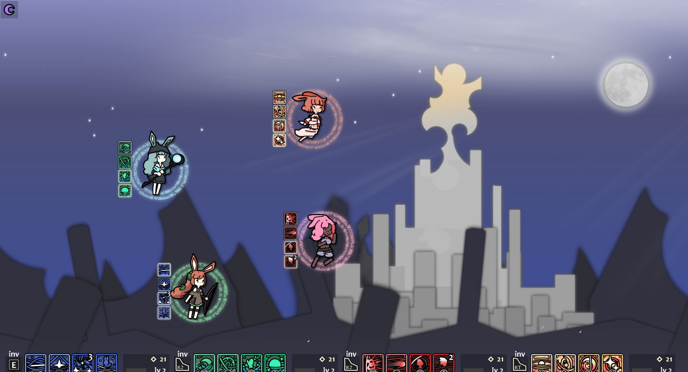

I highly recommend this game. It has a great soundtrack, insanely cool mechanics, and rabbit girls.

=== https://store.steampowered.com/app/3167020/Escape_From_Duckov/[Escape from Duckov]

The obvious parody of Escape from Tarkov is actually a very fun game. It doesn't take itself too seriously, but it has the basics of an extraction shooter done well.

image::escape_from_duckov.png[]

It's of course much more approachable than tarkov. But it's fun, still has a lot of surprises, and the progression is very cool, with questlines leading you to new places to go and scavenge.

Liked it a lot.

=== https://store.steampowered.com/app/1808500/ARC_Raiders/[Arc Raiders]

A very popular game. Doesn't need much more feedback from me. It's a good extraction shooter that has some well made physics-based ennemies. The community was still very fun to play with when i was playing it, with most players being friendly or funny.

=== https://store.steampowered.com/app/2983410/Xenopurge/[Xenopurge]

I fucking love Xenopurge.

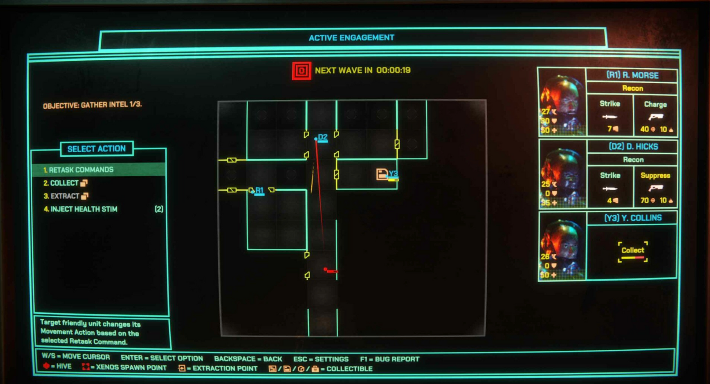

It's a game about coordinating a squad of soldiers exploring a facility. They always have some objective (extract a VIP, find documents..) that they have to do before leaving. Of course, enemies spawn regularly, and get more and more powerful as time passes.

What's great is that you only interact with your team through this simple graphical interface.

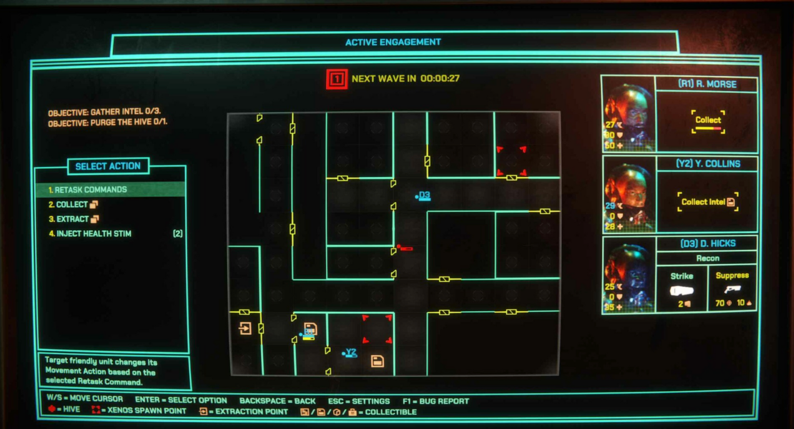

What makes the game so interesting is that you do not have full control of you characters. It's not a RTS game, you don't select your unit and click where you want it to go. You only have vague orders to give such as "explore", "group up", "stand still". And you don't even use your mouse for that, only your keyboard.

This is a run-based game, where you choose your path and challenges in a "Slay the Spire"-inspired map.

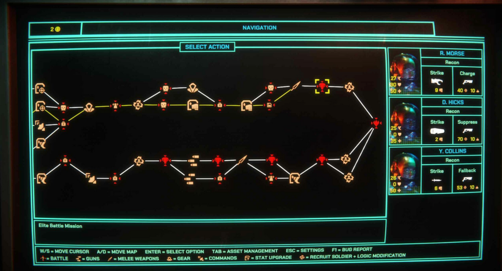

Each successful mission gives you coin to spend on upgrades for your team, with the last mission being a big one with multiple objectives to do.

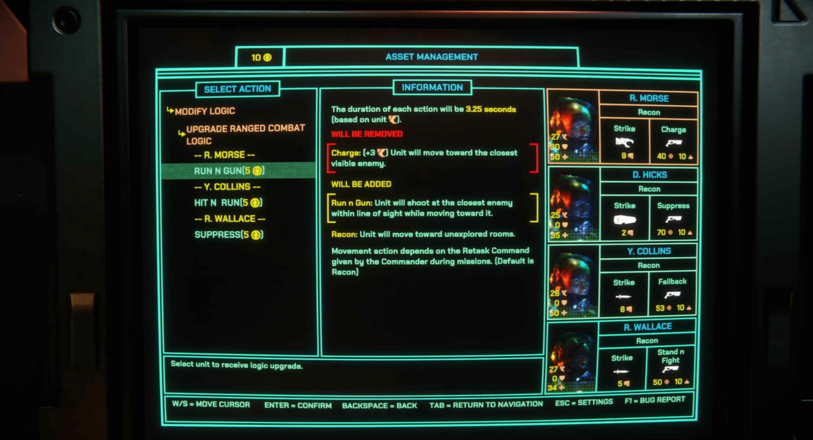

There is a ton of replayability in this game. There are multiple squads with different mechanics (Synthetics that can't heal but can be repaired for some coin, Bio-engineered soldiers that can get permanent buffs by spending resources collected when killing aliens..).

It's a game that truly reward tactical thinking and your ability to predict what can happen. By being smart in your positioning and movement of your unit, you can truly go through odds that would seem absolutely impossible.

My personal favorite this year.

=== https://store.steampowered.com/app/2427700/Backpack_Battles/[Backpack Battles]

My newest addiction. It's backpack hero but with asynchronous multiplayer.

It's dumb, I love it. The balance in the game is great, and you can always make something that works more or less, the "more or less" part being the difference between winning and losing. But because you can always have something that seems to work, you're never feeling like you were unlucky in what has been given to you.

Lot of starting classes, item combinations...

I had to stop playing it to write this and it's *HARD.*

This game is addictive as hell. Art is horrible though.

image::backpack_battles.png[]

== Video games: things i'm still playing.

Just to make it quick:

- Eve Online: I don't wanna talk about it.
- Space Marine 2: there were a lot of cool updates that added a lot of content for free. Still love this game.

== Books

=== The Horus Heresy

I've been keeping up on reading the whole Horus Heresy series. As with every series with multiple author, the quality between tomes can vary, but it's overall a good read (as long as you're not expecting something too deep).

I'm not going to go through all the books i've read so far but some are worth mentioning.

==== Nemesis

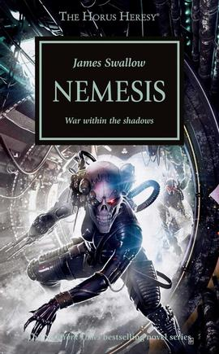

I've seen multiple times this specific book to be quoted as "the one you should read if you want to see if you're into the Horus Heresy series". So I was pretty hyped to finally reach it.

The plot is simple: a squad of Imperium assassins are tasked to kill their greatest target yet, and possible: Horus, the warmaster, traitor Primarch. The squad is composed of all the specific types of assassins the Imperium has around: a sniper, a poison-user, a tech/hacker, a berserker... Tensions arise regularly between the approaches of these different assassins, while they struggle to reach their impossibly important target.

For a book that was so regularly quoted, it felt... Not that great. It wasn't a bad book, but some of the previous book in the series were more interesting (such as Legion, A Thousand Sons..). It diverges from the usual space marine-centered story, but the assassins are still very much biologically enhanced humans with inhumane reactions and strength.

The only thing I truly enjoyed in this book is that one character that was relatively prominent and important in the previous books gets absolutely obliterated with no word, no comment, nothing. I can appreciate when an author dares to kill characters that brutally.

==== Prospero Burns

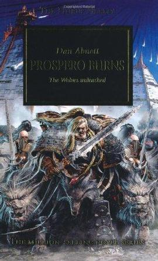

Prospero Burns is centered on the Space Wolves, a space marine legion who roleplay as viking lycanthropes. I fucking hate the space wolves.

But that's the best book in the series so far, and among the best book i've ever read.

If you are curious, just jump to the next chapter and do not read the rest of this review. Last warning.

For context, Prospero is the home world of another legion, the Thousand Sons, who were deemed for annihilation by decree of the Emperor because their primarch, Magnus, did everything wrong. Don't @ me. Because of this, the Space Wolves were sent to destroy Prospero.

The book has at most 2 chapters happening in Prospero. Most of the book is centered on an archivist that realized at some point that no data exists on the Space Wolves: no edicts, no rules, no words. The main character learns the reason for that :the Space Wolves only have an oral history, nothing is ever written.

Here is why this book is fantastic. The main character becomes a half-space-marine, and more importantly joins the caste of "storytellers" of the Space Wolves. Because they have no written history, the tales of any member of the legion (and especially their death), is remembered through stories told in great ceremonies.

The beginning of this book is HORRIBLE. It is simply said, abhorrently written. Instead of using the right word for a concept, there is this approach of appending two words that almost get the right definition for what the author wanted to say. The sentences are short and with nothing else than the bare minimum. I almost dropped the book at the first chapter. But then I remembered that the author of this book is https://en.wikipedia.org/wiki/Dan_Abnett[Dan Abnett] who is not known for being a terrible writer. What could have happened?

I forced myself to read, and it got better progressively. Reaching even some peak moments at the end, moments where you tell yourself "damn, that was good".

So I asked myself why the beginning of the book was so bad. But then I realized.

At the beginning, the main character is not good at what he's tasked to do. He's an archivist. He collects data, put it together, sort it, ensure its safety. But he's now forced to narrate these informations.

The book gets progressively better in writing quality because the main character, and often narrator, becomes better as a storyteller progressively.

That is pure genius.

=== The Alpha Centauri books

Did you know that, parallel to the release of Sid Meier's Alpha Centauri (which is still among the best civ-likes, if not the best, to this day), were 3 novels?

They are considered pretty bad.

I can confirm, I could not even end the first one. They are horrible to read. The books try to present the mechanics of the game as something integral to the story, and it falls just incredibly flat every time.

Playing Alpha Centauri itself is a much better narrative experience. Do not bother with these books.

== Music

I've bought a lot of cool stuff this year. Here are some of the best.

=== The Long Forever - Elephant Tree / Lowrider

++++
<iframe style="border: 0; width: 100%; height: 120px;" src="https://bandcamp.com/EmbeddedPlayer/album=3921228939/size=large/bgcol=ffffff/linkcol=0687f5/tracklist=false/artwork=small/transparent=true/" seamless><a href="https://lowriderofficial.bandcamp.com/album/the-long-forever">The Long Forever de Elephant Tree / Lowrider</a></iframe>
++++

A cool collab album of good old heavy rock. `Into The Grey` Might be my favourite here.

=== PowerNerd - Devin Townsend

++++
<iframe style="border: 0; width: 100%; height: 120px;" src="https://bandcamp.com/EmbeddedPlayer/album=1585916002/size=large/bgcol=ffffff/linkcol=0687f5/tracklist=false/artwork=small/transparent=true/" seamless><a href="https://devintownsend.bandcamp.com/album/powernerd-24-bit-hd-audio">PowerNerd (24-bit HD audio) de Devin Townsend</a></iframe>
++++

If you've never heard of Devin Townsend, you're going to be in for something. This is some cool experimental metal made from an absolute mad lad. Devin is still having a ton of fun in his music, and it's hard not to join in the fun.

=== Apogee - Kouek

++++
<iframe style="border: 0; width: 100%; height: 120px;" src="https://bandcamp.com/EmbeddedPlayer/album=4053228953/size=large/bgcol=ffffff/linkcol=0687f5/tracklist=false/artwork=small/transparent=true/" seamless><a href="https://mypetflamingo.bandcamp.com/album/apogee">Apogee de Kouek</a></iframe>
++++

Some very cool 80s inspired pop, very reminiscent of Paradise Killer's soundtrack.

=== Hicimos crecer un bosque - Fin del Mundo

++++
<iframe style="border: 0; width: 100%; height: 120px;" src="https://bandcamp.com/EmbeddedPlayer/album=3170037550/size=large/bgcol=ffffff/linkcol=0687f5/tracklist=false/artwork=small/transparent=true/" seamless><a href="https://findelmundo.bandcamp.com/album/hicimos-crecer-un-bosque">Hicimos crecer un bosque de Fin del Mundo</a></iframe>
++++

The 4 argentian shoegaze girls are back. If you enjoy shoegaze, they're very cool.

=== The lost experiment - The Chemist & the Acevities

++++
<iframe style="border: 0; width: 100%; height: 120px;" src="https://bandcamp.com/EmbeddedPlayer/album=315301942/size=large/bgcol=ffffff/linkcol=0687f5/tracklist=false/artwork=small/transparent=true/" seamless><a href="https://thechemistandtheacevities.bandcamp.com/album/the-lost-experiment">The lost experiment de The Chemist &amp; the Acevities</a></iframe>
++++

It's my brother in-law's surf rock group. I like it. Share it.

=== Wah!!! - Chinese American Bear

++++
<iframe style="border: 0; width: 100%; height: 120px;" src="https://bandcamp.com/EmbeddedPlayer/album=3008962068/size=large/bgcol=ffffff/linkcol=0687f5/tracklist=false/artwork=small/transparent=true/" seamless><a href="https://chineseamericanbear.bandcamp.com/album/wah">Wah!!! de Chinese American Bear</a></iframe>
++++

I stumbled upon this completely randomly, and bought it right away. It's some very good (synth-)pop that makes you groove instantly.

=== Hot Shock - HotWax

++++
<iframe style="border: 0; width: 100%; height: 120px;" src="https://bandcamp.com/EmbeddedPlayer/album=517412101/size=large/bgcol=ffffff/linkcol=0687f5/tracklist=false/artwork=small/transparent=true/" seamless><a href="https://hotwax2.bandcamp.com/album/hot-shock">Hot Shock de HotWax</a></iframe>
++++

More punk rock from them. They still manage to be so rooted in old school punk-rock while sounding modern enough.

=== Overcoming - Yolomood

++++
<iframe style="border: 0; width: 100%; height: 120px;" src="https://bandcamp.com/EmbeddedPlayer/album=512786725/size=large/bgcol=ffffff/linkcol=0687f5/tracklist=false/artwork=small/transparent=true/" seamless><a href="https://yolomood.bandcamp.com/album/overcoming">Overcoming de yolomood</a></iframe>
++++

Latest album of these brazilian guys. Kinda like HotWax, there's something very old-school in how it's structured. Still love them.

=== Phantom Island - King Gizzard & The Lizard Wizard

++++
<iframe style="border: 0; width: 100%; height: 120px;" src="https://bandcamp.com/EmbeddedPlayer/album=3867244044/size=large/bgcol=ffffff/linkcol=0687f5/tracklist=false/artwork=small/transparent=true/" seamless><a href="https://kinggizzard.bandcamp.com/album/phantom-island">Phantom Island de King Gizzard &amp; The Lizard Wizard</a></iframe>
++++

Yearly release of KG&TLW. `Deadstick` grooves so fucking hard.

=== DOGGOD - L.A. WITCH

++++
<iframe style="border: 0; width: 100%; height: 120px;" src="https://bandcamp.com/EmbeddedPlayer/album=3365797310/size=large/bgcol=ffffff/linkcol=0687f5/tracklist=false/artwork=small/transparent=true/" seamless><a href="https://lawitches.bandcamp.com/album/doggod">DOGGOD de L.A. WITCH</a></iframe>
++++

These girls are good.

=== A Captain's Final Message - Othrship

++++
<iframe style="border: 0; width: 100%; height: 120px;" src="https://bandcamp.com/EmbeddedPlayer/album=1341722779/size=large/bgcol=ffffff/linkcol=0687f5/tracklist=false/artwork=small/transparent=true/" seamless><a href="https://othrship.bandcamp.com/album/a-captains-final-message">A Captain&#39;s Final Message de Othrship</a></iframe>
++++

They present themselves as "space-themed jazz rock band" and that fits the description perfectly. I really like their work.

=== Static Calls - Startographers

++++
<iframe style="border: 0; width: 100%; height: 120px;" src="https://bandcamp.com/EmbeddedPlayer/album=794444680/size=large/bgcol=ffffff/linkcol=0687f5/tracklist=false/artwork=small/transparent=true/" seamless><a href="https://startographers.bandcamp.com/album/static-calls">Static Calls de Startographers</a></iframe>
++++

Some great shoegaze that rolls on the ears.

=== moisturizer - Wet Leg

++++
<iframe style="border: 0; width: 100%; height: 120px;" src="https://bandcamp.com/EmbeddedPlayer/album=354454211/size=large/bgcol=ffffff/linkcol=0687f5/license_id=4621/tracklist=false/artwork=small/transparent=true/" seamless><a href="https://wetleg.bandcamp.com/album/moisturizer">moisturizer de Wet Leg</a></iframe>
++++

If `CPR` doesn't stay in your head for weeks, we're clearly not from the same mould.

=== Something To Consume - Die Spitz

++++
<iframe style="border: 0; width: 100%; height: 120px;" src="https://bandcamp.com/EmbeddedPlayer/album=214242996/size=large/bgcol=ffffff/linkcol=0687f5/tracklist=false/artwork=small/transparent=true/" seamless><a href="https://diespitz.bandcamp.com/album/something-to-consume">Something To Consume de Die Spitz</a></iframe>
++++

Some good ol' heavy metal from an all-girl band. Go check their live videos on youtube, they're really good. Also their bassist is absolutely adorable.
