This time I tried to do it all year so I don't forget too much stuff.

== Video Games

=== Witchspring R

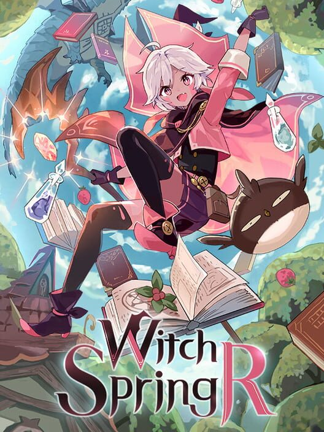

A very classical JRPG following a young witch in a world where they are persecuted. Combat is turn by turn, exploration is based on gathering resources and crafting. Overall a pleasant experience: the writing is funny enough, combat has some interesting parts (and you can even make a fighter witch instead of a magical witch).

It kind of overstayed its welcome for me though, i got a bit tired of it at the end. Steam comments seem to agree that the DLC is not very interesting, but I haven't played it. Still a fun game.

== Books

=== Various

==== The Snare of the Tree, and Other Perilous Seductions

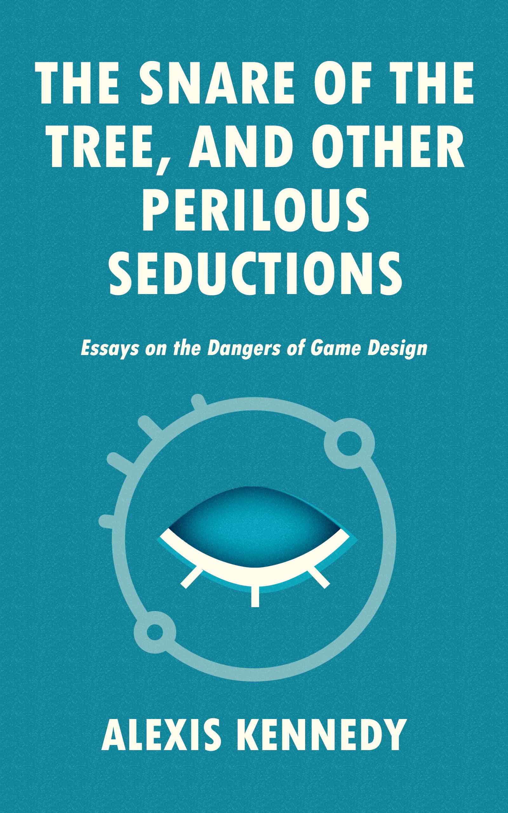

This is a book from one of the creators of the game Cultist Simulator, also worked on Fallen London. It's a very short book, less than a hundred pages, giving advices on game design. It interestingly focuses on traps that are easy to fall into but rarely discussed (for example, how a temporary name for a game might influence its design). If you're interested in game design, it's worth reading, and very short.

And if you liked it, you should probably read the main book from the same author: "Against Worldbuilding, and other provocations"

=== The Horus Heresy series

==== The Primarchs

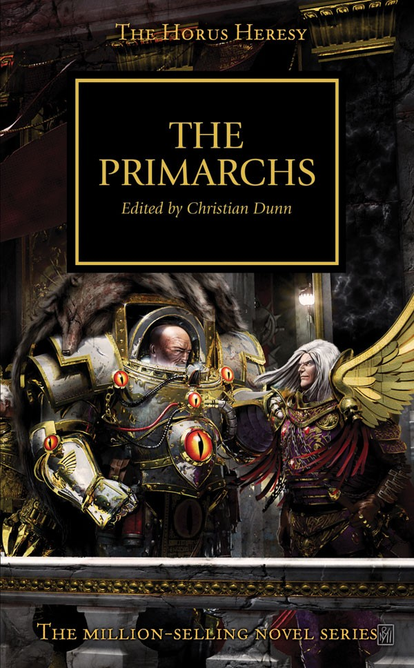

It's a collection of short novels, each one focused on a specific primarch. Not necessarily from the point of view of a primarch, but still very tightly tied to one of them.

Some of my favorite characters of the horus heresy appear on this one, notably Lucius (a chaos space marine that wants to be the greatest swordmaster) and the Alpha Legion twin primarchs (in which they plan an operation against their own, classic Alpha Legion move).

Overall a decent read.

==== Fear to Tread

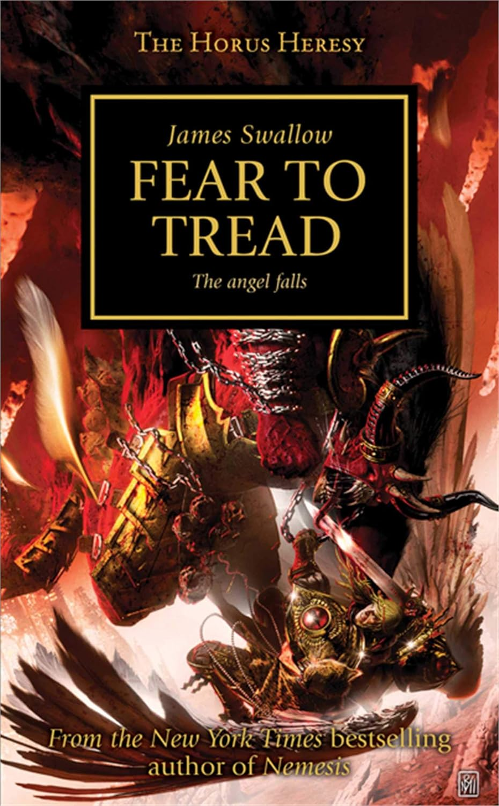

This one is centered around the Blood Angels, the "we're vampires lol" legion. Just like the Space Wolves, i used to not be very interested in them and found them pretty bland, but once you read a bit more about them, they're more interesting than I expected.

The novel narrates the events of how Sanguinius and his legion were sent into a trap by Horus, before knowing of his treachery. There is a lot of foreshadowing on the future events of WH40k toward this specific legion.

It's the same author than Nemesis. I didn't like Nemesis very much, and this book started a bit boring, but the last chapters were a nice read.

==== Angel Exterminatus

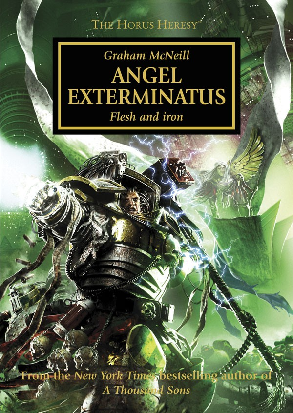

This book deals with the Emperor's Legion, which are at this point just a slaanesh cult, and the Iron Warriors. It is mostly about the Iron Warriors though, and especially on their primarch Perturabo. Fulgrim manages to coerce Perturabo into going into the Eye of Terror, the big warp storm that lingers since the birth of slaanesh, to resurrect some kind of ancient weapon.

It was a good read overall, though Perturabo is at first represented as a ball of anger that can't control himself anymore, but most of the book he actually is in control? It was a bit strange. Though it was interesting to learn more about the Iron Warriors. They're a traitor legion, but they haven't really fell to chaos, compared to the other legions.

Oh and because it's with the Emperor's Legion, there are my 2 favorites: Lucius and Fabius.

==== Betrayer

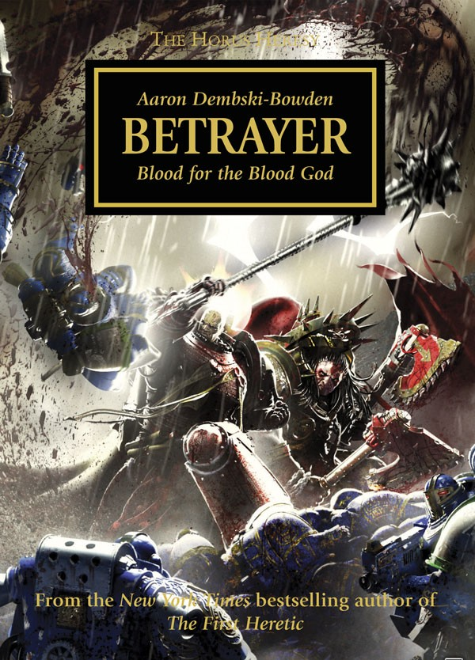

I always heard that this book has quite the reputation of being epic. This is clearly an understatement. In less than a hundred kindle-sized pages, the following events occur:

- Lorgar slamming an airship to the ground with his bare hands
- Angron almost burying himself alive because a building fell on his face and he started digging toward the center of the world instead of toward the surface 
- Lorgar tanking a whole ass titan plasma shot
- Angron stopping a titan from crushing Lorgar with his bare hands
- Kharne showing he has the biggest balls of the universe by scolding Angron for not saying thanks to Lorgar

Apart from the epic scenes, the book is about the downfall of the World Eaters legion, finally driven mad thanks to the machinations of Lorgar and the Word Bearers. At the end of the book, Angron has now fully fell to Khorne's influence, and the entire legion follows. 

It was a cool read, probably the best from this author so far.

== Webtoons/Manga

=== The Greatest Estate Developer

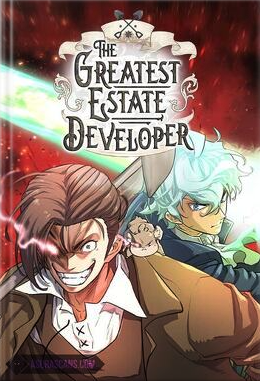

I already talked about it in the 2024 edition of the media recap, but this webtoon is finally over. It went hard for the final, and honestly, that was just great.

It's fine that they finally ended the series. The author managed to stay epic and funny at a constant rate through it, and that's already a feat. No need to push it further.

If you haven't read it, it's an extremely funny isekai webtoon, where the main character constantly acts like a villain while still being a hero. Consciously. 

=== Mashle 

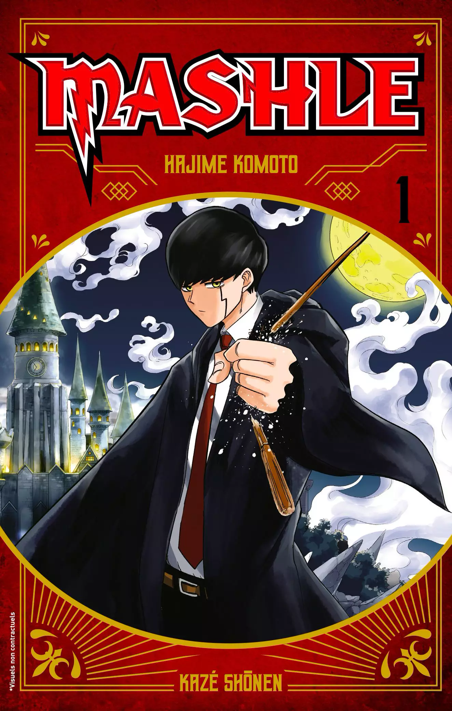

In a world where magic is king, the main character does not have an ounce of it. Instead, he has muscles. We're talking about one-punch man tier strength here.

It's an absurd parodic manga. Some scenes are absolutely hilarious, but most of the time it wasn't particularly good. A light read if you don't have anything else to read. 

=== Leviathan

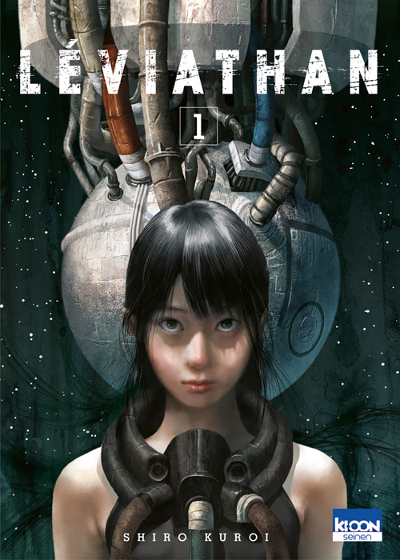

A short manga of 3 tomes. The story follows treasure hunters / pillagers that go inside an old derelict spacecraft, hoping to find valuables. The only thing they find is the diary of a young boy describing the events of what happened to the ship: hit by an unknown force, the children and their 2 teachers are now stuck inside and unable to call for help. And they also only have 36 hours of oxygen left.

The manga switches between the pillagers point of view and the kid's retelling of the events.

The art itself is really nice, with the intro pages of each book having a nice colouring too.

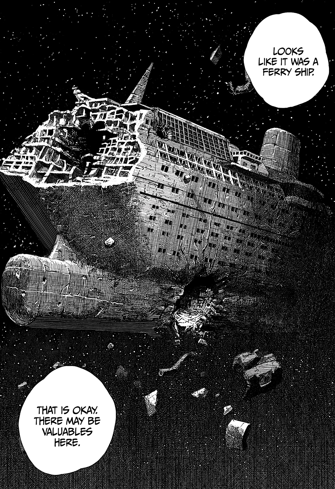

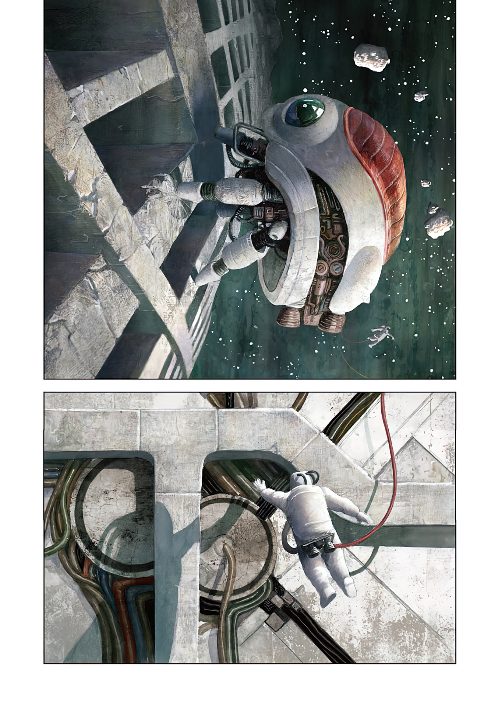

A short and cool read.

== Movies / Series

=== All You Need Is Kill

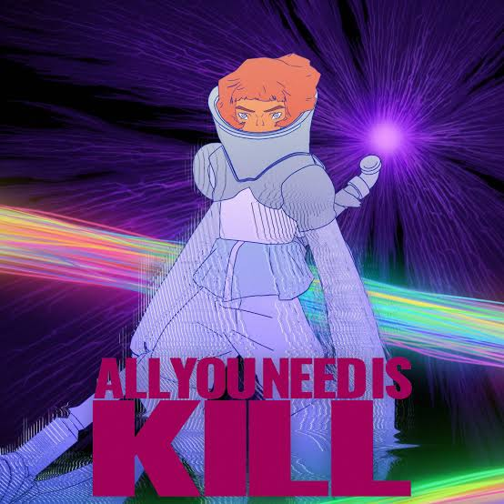

Nice anime movie inspired by the manga of the same name. The art style is striking, very unique, blending western and japanese style, with gorgeous backgrounds and good animation. It surprisingly gets better and better along the movie, the beginning feeling relatively bland, when the last quarter of the movie being on entire another level.

It doesn't follow the manga exactly which is ok. The original manga was still about aliens invading earth and a main character that lives the same day over and over, but where the original manga was set up in the middle of the war against the aliens, this one is at the beginning.

It still has the same plot twist than the manga, that I won't spoil here.

If you can see it, it's a good time, worth its bucks in a movie theater. And the manga is great and short too, don't hesitate !

=== Kill Lupercal

And another media in the Horus Heresy series! I had a few ours in a train for work so I decided to check this. 

This is a small 3D animated series following a Titan pilot and its crew among the Siege of Terra, the final part of the Horus Heresy. One of their ally report having seen Horus himself on the battlefield, and tries to convince all other close titans to take this opportunity and kill him.

It was well done overall. The 3D is nice, the voice acting was nice. There are some good details related to  titan-piloting of the Warhammer universe. If you have some spare time, it's worth the pair of hours that are available.

== Music