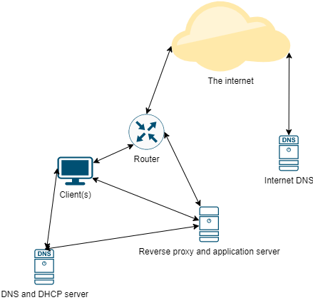

Hey everyone.
I've decided to start a small set of tutorials that should allow you to setup and maintain an IT infrastructure at home relatively easily.

These tutorials suppose that you know how to:
- Access your router's configuration panel - ssh into a remote system - Know some basics of networking.

The rest will be as self-explanatory as possible, or i'll try to link to some other sources that will explain everything.

Networking is not my line of work, and what i'm describing here is only what i think is a decent home set-up that is easy to maintain.

== Introduction

=== Hardware requirements

This whole series supposes that you have 2 machines for your infrastructure

- A low-powered machine dedicated to DHCP and internal DNS
- A "server" machine that will host the applications you want to host.

For the first machine, a raspberry pi-like machine is enough.
You don't even need a "high end" pi, a simple raspberry pi 2 or 3 would be enough.
Anything else would probably be overkill.

For the second machine, I'd advise using something more beefy and more importantly, something with an x86_64 processor, not an ARM one.
I personnally use an Intel NUC machine as they're pretty silent and the small form-factor is practical.

ARM is excellent, and you can do with an ARM server machine, but it will bring a bit more work later.
Mostly, this setup relies on using docker almost exclusively for hosting applications, and not all docker images are ARM compatible.
You can circumvent that by building your own docker images, but that can be a lot of work.

=== Overall architecture

Here is an attempt at making a diagram.

The dns + dhcp server will manage the minimum networking necessary (apart from the router itself).

Separating it makes it much easier to manage everything.
Also, you won't be touching this machine very much apart from the occasional upgrade.
As it is critical for your internal network, separating it on a small machine is easy and practical.

On the other hand, the "main" server will be used as a reverse proxy (to make our apps available easily internally and from outside the network) and will the apps at the same time.
The other bonus of separating the DNS from the host system is that it simplify managing our docker containers later: docker can be a hassle to configure when your DNS is on the same machine.

== Part 1 : setting up the DNS + DHCP

Here's the thing, we're not just going to set up a simple DNS, we're going to use https://pi-hole.net/[pi-hole].

Pi-hole is a "network-wide ad blocker" that is actually a DNS server. It's just that DNS requests made to domains associated to ads are rejected by the pi-hole, which effectively blocks the ads.

What is really great is that pi-hole has it's own DHCP server integrated too! It basically does everything we want in one go.

=== Installing pi-hole

At this point, I consider that you have a running raspberry-pi that you can configure either directly or through ssh.
If you don't know how to activate SSH on your pi, refer to the https://www.raspberrypi.org/documentation/computers/remote-access.html[official documentation]