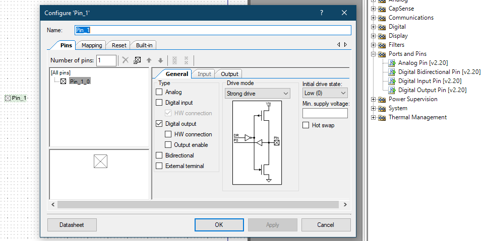
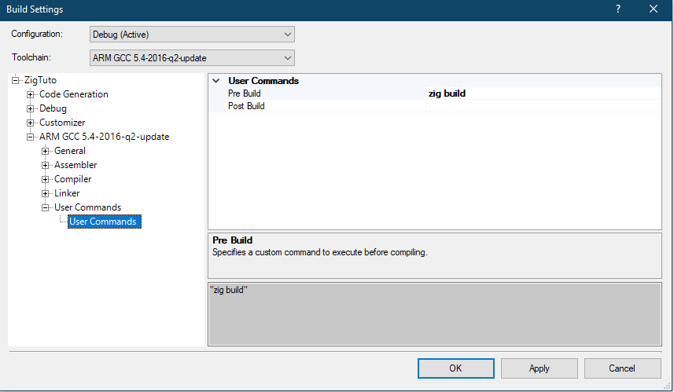
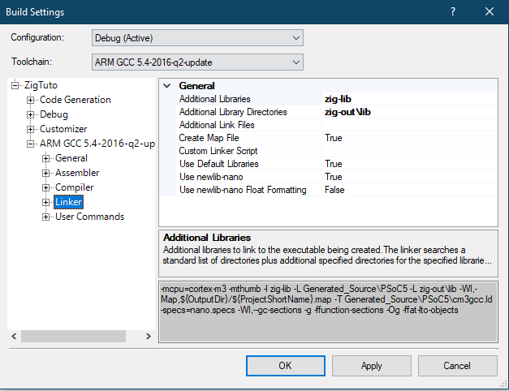

Let's make a very simple tutorial on how to use Zig for cypress STM32 boards. You'll be surprised how easy it is.

== Making a Zig library usable in PSoC Creator

Let's start by making a new project in PSoC Creator, Cypress' IDE. I'm using a CY8CKIT-059 board here.

We first are going to leverage PSoC Creator's tools to add a controllable pin to our software. This pin will drive the LED on our kit.

This should be enough. Let's build the project as it is right now, so PSoC Creator can generate for us all the code that will allow us to use this pin.

We will start with something very basic: we're going to make our pin blink on a timer, and the value of the timer will be obtained from a Zig library.

Let's start with the code in the `main.c` source file.

[source, c]
----
#include "project.h"

int main(void)
{
    CyGlobalIntEnable; /* Enable global interrupts. */

    /* Place your initialization/startup code here (e.g. MyInst_Start()) */

    uint32_t delay = zig_get_delay();

    for(;;)
    {
       Pin_1_Write(0); // switch off the LED
       CyDelay(delay); // delay
       Pin_1_Write(1); // switch on the LED
       CyDelay(delay); // delay
    }
}
----

// suppress inspection "GrazieInspection"
Now we just have to make the `zig_get_delay` function in a zig library. Let's set up a simple build.zig file.

.build.zig
[source, zig]
----
const std = @import("std");

pub fn build(b: *std.build.Builder) void {
// Standard release options allow the person running `zig build` to select
// between Debug, ReleaseSafe, ReleaseFast, and ReleaseSmall.
const mode = b.standardReleaseOptions();

    var lib = b.addStaticLibrary("zig-lib", "lib.zig");
    const starget = std.zig.CrossTarget.parse(.{
        .arch_os_abi = "arm-freestanding-none",
        .cpu_features = "cortex_m3", }) catch unreachable;
    lib.setBuildMode(mode);
    lib.setTarget(starget);
    lib.install();

    var main_tests = b.addTest("src/demo.zig");
    main_tests.setBuildMode(mode);

    const test_step = b.step("test", "Run library tests");
    test_step.dependOn(&main_tests.step);
}
----

Our cross-target options will make something that PSoC Creator can use. Now let's make the zig source file itself.

.lib.zig
[source, zig]
----
export fn zig_get_delay() u32 {
    return 542;
}
----

Nothing fantastic here. I'm assuming these 2 files are at the root of your PSoC Creator project.

Now let's make PSoC Creator build the zig library and link it.

First, add a custom pre-build user command in your build settings.

And a step to get the resulting library file and link it to our project.

And at this point, everything should be fine already! Just clean and build.

.Output
[sources]
----
Elaborating Design...
HDL Generation...
Synthesis...
Tech Mapping...
ADD: pft.M0040: information: The following 1 pin(s) will be assigned a location by the fitter: Pin_1(0)
Analog Placement...
Analog Routing...
Analog Code Generation...
Digital Placement...
Digital Routing...
Bitstream Generation...
Bitstream Verification...
Static timing analysis...
API Generation...
Dependency Generation...
Cleanup...
zig build
arm-none-eabi-gcc.exe -mcpu=cortex-m3 -mthumb -I. -IGenerated_Source\PSoC5 -Wa,-alh=.\CortexM3\ARM_GCC_541\Debug/main.lst -g -D DEBUG -D CY_CORE_ID=0 -Wall -ffunction-sections -ffat-lto-objects -Og -c main.c -o .\CortexM3\ARM_GCC_541\Debug\main.o
arm-none-eabi-gcc.exe -mcpu=cortex-m3 -mthumb -I. -IGenerated_Source\PSoC5 -Wa,-alh=.\CortexM3\ARM_GCC_541\Debug/cyfitter_cfg.lst -g -D DEBUG -D CY_CORE_ID=0 -Wall -ffunction-sections -ffat-lto-objects -Og -c Generated_Source\PSoC5\cyfitter_cfg.c -o .\CortexM3\ARM_GCC_541\Debug\cyfitter_cfg.o
arm-none-eabi-gcc.exe -mcpu=cortex-m3 -mthumb -I. -IGenerated_Source\PSoC5 -Wa,-alh=.\CortexM3\ARM_GCC_541\Debug/cymetadata.lst -g -D DEBUG -D CY_CORE_ID=0 -Wall -ffunction-sections -ffat-lto-objects -Og -c Generated_Source\PSoC5\cymetadata.c -o .\CortexM3\ARM_GCC_541\Debug\cymetadata.o
arm-none-eabi-gcc.exe -mcpu=cortex-m3 -mthumb -I. -IGenerated_Source\PSoC5 -Wa,-alh=.\CortexM3\ARM_GCC_541\Debug/Pin_1.lst -g -D DEBUG -D CY_CORE_ID=0 -Wall -ffunction-sections -ffat-lto-objects -Og -c Generated_Source\PSoC5\Pin_1.c -o .\CortexM3\ARM_GCC_541\Debug\Pin_1.o
arm-none-eabi-gcc.exe -mcpu=cortex-m3 -mthumb -I. -IGenerated_Source\PSoC5 -Wa,-alh=.\CortexM3\ARM_GCC_541\Debug/Cm3Start.lst -g -D DEBUG -D CY_CORE_ID=0 -Wall -ffunction-sections -ffat-lto-objects -Og -c Generated_Source\PSoC5\Cm3Start.c -o .\CortexM3\ARM_GCC_541\Debug\Cm3Start.o
arm-none-eabi-gcc.exe -mcpu=cortex-m3 -mthumb -I. -IGenerated_Source\PSoC5 -Wa,-alh=.\CortexM3\ARM_GCC_541\Debug/CyDmac.lst -g -D DEBUG -D CY_CORE_ID=0 -Wall -ffunction-sections -ffat-lto-objects -Og -c Generated_Source\PSoC5\CyDmac.c -o .\CortexM3\ARM_GCC_541\Debug\CyDmac.o
arm-none-eabi-gcc.exe -mcpu=cortex-m3 -mthumb -I. -IGenerated_Source\PSoC5 -Wa,-alh=.\CortexM3\ARM_GCC_541\Debug/CyFlash.lst -g -D DEBUG -D CY_CORE_ID=0 -Wall -ffunction-sections -ffat-lto-objects -Og -c Generated_Source\PSoC5\CyFlash.c -o .\CortexM3\ARM_GCC_541\Debug\CyFlash.o
arm-none-eabi-gcc.exe -mcpu=cortex-m3 -mthumb -I. -IGenerated_Source\PSoC5 -Wa,-alh=.\CortexM3\ARM_GCC_541\Debug/CyLib.lst -g -D DEBUG -D CY_CORE_ID=0 -Wall -ffunction-sections -ffat-lto-objects -Og -c Generated_Source\PSoC5\CyLib.c -o .\CortexM3\ARM_GCC_541\Debug\CyLib.o
arm-none-eabi-gcc.exe -mcpu=cortex-m3 -mthumb -I. -IGenerated_Source\PSoC5 -Wa,-alh=.\CortexM3\ARM_GCC_541\Debug/cyPm.lst -g -D DEBUG -D CY_CORE_ID=0 -Wall -ffunction-sections -ffat-lto-objects -Og -c Generated_Source\PSoC5\cyPm.c -o .\CortexM3\ARM_GCC_541\Debug\cyPm.o
arm-none-eabi-gcc.exe -mcpu=cortex-m3 -mthumb -I. -IGenerated_Source\PSoC5 -Wa,-alh=.\CortexM3\ARM_GCC_541\Debug/CySpc.lst -g -D DEBUG -D CY_CORE_ID=0 -Wall -ffunction-sections -ffat-lto-objects -Og -c Generated_Source\PSoC5\CySpc.c -o .\CortexM3\ARM_GCC_541\Debug\CySpc.o
arm-none-eabi-gcc.exe -mcpu=cortex-m3 -mthumb -I. -IGenerated_Source\PSoC5 -Wa,-alh=.\CortexM3\ARM_GCC_541\Debug/cyutils.lst -g -D DEBUG -D CY_CORE_ID=0 -Wall -ffunction-sections -ffat-lto-objects -Og -c Generated_Source\PSoC5\cyutils.c -o .\CortexM3\ARM_GCC_541\Debug\cyutils.o
arm-none-eabi-gcc.exe -mcpu=cortex-m3 -mthumb -I. -IGenerated_Source\PSoC5 -Wa,-alh=.\CortexM3\ARM_GCC_541\Debug/cy_em_eeprom.lst -g -D DEBUG -D CY_CORE_ID=0 -Wall -ffunction-sections -ffat-lto-objects -Og -c Generated_Source\PSoC5\cy_em_eeprom.c -o .\CortexM3\ARM_GCC_541\Debug\cy_em_eeprom.o
arm-none-eabi-as.exe -mcpu=cortex-m3 -mthumb -I. -IGenerated_Source\PSoC5 -alh=.\CortexM3\ARM_GCC_541\Debug/CyBootAsmGnu.lst -g -W -o .\CortexM3\ARM_GCC_541\Debug\CyBootAsmGnu.o Generated_Source\PSoC5\CyBootAsmGnu.s
arm-none-eabi-ar.exe -rs .\CortexM3\ARM_GCC_541\Debug\ZigTuto.a .\CortexM3\ARM_GCC_541\Debug\Pin_1.o .\CortexM3\ARM_GCC_541\Debug\CyDmac.o .\CortexM3\ARM_GCC_541\Debug\CyFlash.o .\CortexM3\ARM_GCC_541\Debug\CyLib.o .\CortexM3\ARM_GCC_541\Debug\cyPm.o .\CortexM3\ARM_GCC_541\Debug\CySpc.o .\CortexM3\ARM_GCC_541\Debug\cyutils.o .\CortexM3\ARM_GCC_541\Debug\cy_em_eeprom.o .\CortexM3\ARM_GCC_541\Debug\CyBootAsmGnu.o
arm-none-eabi-ar.exe: creating .\CortexM3\ARM_GCC_541\Debug\ZigTuto.a
arm-none-eabi-gcc.exe -Wl,--start-group -o "C:\Users\Arwalk\Documents\PSoC Creator\Zig\ZigTuto.cydsn\CortexM3\ARM_GCC_541\Debug\ZigTuto.elf" .\CortexM3\ARM_GCC_541\Debug\main.o .\CortexM3\ARM_GCC_541\Debug\cyfitter_cfg.o .\CortexM3\ARM_GCC_541\Debug\cymetadata.o .\CortexM3\ARM_GCC_541\Debug\Cm3Start.o .\CortexM3\ARM_GCC_541\Debug\ZigTuto.a "E:\Cypress\PSoC Creator\4.4\PSoC Creator\psoc\content\cycomponentlibrary\CyComponentLibrary.cylib\CortexM3\ARM_GCC_541\Debug\CyComponentLibrary.a" -mcpu=cortex-m3 -mthumb -l zig-lib -L Generated_Source\PSoC5 -L zig-out\lib -Wl,-Map,.\CortexM3\ARM_GCC_541\Debug/ZigTuto.map -T Generated_Source\PSoC5\cm3gcc.ld -specs=nano.specs -Wl,--gc-sections -g -ffunction-sections -Og -ffat-lto-objects -Wl,--end-group
cyelftool.exe -C "C:\Users\Arwalk\Documents\PSoC Creator\Zig\ZigTuto.cydsn\CortexM3\ARM_GCC_541\Debug\ZigTuto.elf" --flash_row_size 256 --flash_size 262144 --flash_offset 0x00000000
No ELF section .cychecksum found, creating one
Application checksum calculated and stored in ELF section .cychecksum
Checksum calculated and stored in ELF section .cymeta
cyelftool.exe -S "C:\Users\Arwalk\Documents\PSoC Creator\Zig\ZigTuto.cydsn\CortexM3\ARM_GCC_541\Debug\ZigTuto.elf"
Flash used: 1254 of 262144 bytes (0,5 %).
SRAM used: 2521 of 65536 bytes (3,8 %). Stack: 2048 bytes. Heap: 128 bytes.
--------------- Build Succeeded: 11/13/2021 11:32:41 ---------------
----

== Calling Cypress methods from zig

What if we want to run cypress methods from our zig sources?

It's simple, just ask for them! The `extern` keyword is enough for the linker to make his magic.

Let's change our source code so our core loop is inside zig.

.main.c
[source, c]
----
#include "project.h"

extern uint32_t zig_main();

int main(void)
{
    CyGlobalIntEnable; /* Enable global interrupts. */

    /* Place your initialization/startup code here (e.g. MyInst_Start()) */

    zig_main();
}
----

.lib.zig
[source, zig]
----
extern fn Pin_1_Write(value: u8) void;
extern fn CyDelay(milliseconds: u32) void ;

export fn zig_main() void {
    while(true) {
        Pin_1_Write(0); // switch off the LED
        CyDelay(1000); // delay
        Pin_1_Write(1); // switch on the LED
        CyDelay(1000); // delay
    }
}
----

And... That's it. That's all you need.

== The good, the bad and the ugly hack

Ok, here's a quick hack for fun. `main` is a method like any other. You can actually link to main from a library.

.main.c
[source, c]
----
#include "project.h"

extern int main(void);
----

.lib.zig
[source, zig]
----
extern fn Pin_1_Write(value: u8) void;
extern fn CyDelay(milliseconds: u32) void ;

export fn main() c_int {
    while(true) {
        Pin_1_Write(0); // switch off the LED
        CyDelay(1000); // delay
        Pin_1_Write(1); // switch on the LED
        CyDelay(1000); // delay
    }
}
----

That's not pretty, but now you can do everything from zig!

== Leveraging zig in this environment

You now have access to all the zig language, but also to a good part of the zig std lib. Most of the zig std doesn't rely on c libraries, and can now be easily used.

Let's make our blinking random, using zig's random functions.

.lib.zig
[source, zig]
----

extern fn Pin_1_Write(value: u8) void;
extern fn CyDelay(milliseconds: u32) void ;

const std = @import("std");
var prng = std.rand.DefaultPrng.init(542);

fn get_random() u32 {
    return std.rand.Random.uintAtMost(&prng.random, u32, 2000);
}

export fn main() c_int {
    while(true) {
        Pin_1_Write(0); // switch off the LED
        CyDelay(get_random()); // delay
        Pin_1_Write(1); // switch on the LED
        CyDelay(get_random()); // delay
    }
}
----

The sky is the limit at this point. And you can leverage zig's allocator pattern to use dynamically allocated memory too: just have to write the allocator for your board.

Have fun!